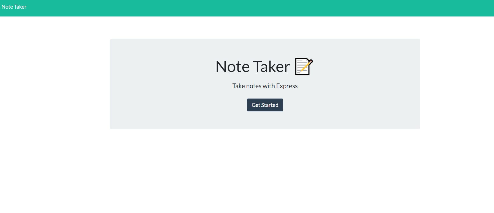

# NoteTaker

## Description
This project is a tool to record notes and to view previously entered notes. The application was developed using node.js and Express. The project has been deployed to Heroku. 

## Table of Contents
- [Installation](#installation)
- [Usage](#usage)
- [Credits](#credits)
- [License](#license)
- [Screenshots](#screenshots)

## Installation
The user should fork this repo and open the files locally. The user should be sure to run npm i to install dependencies.

## Usage
To use the application, the user should open a node terminal, install all dependencies, and run node index. When viewing port 8080, the user will see a home page prompting them to continue to the note-taker page. Here, the user will see any previously stored notes and as well as be able to save additional notes. 
Watch this video to learn how to use this application: https://drive.google.com/file/d/1WHOW4Y_ysBNZb4U0tmbyn6a5gmF2iWgE/view?usp=sharing 

## Screenshots

## Credits
Special shoutout to Columbia Coding Bootcamp for helping to me to make this application!

## License
MIT
